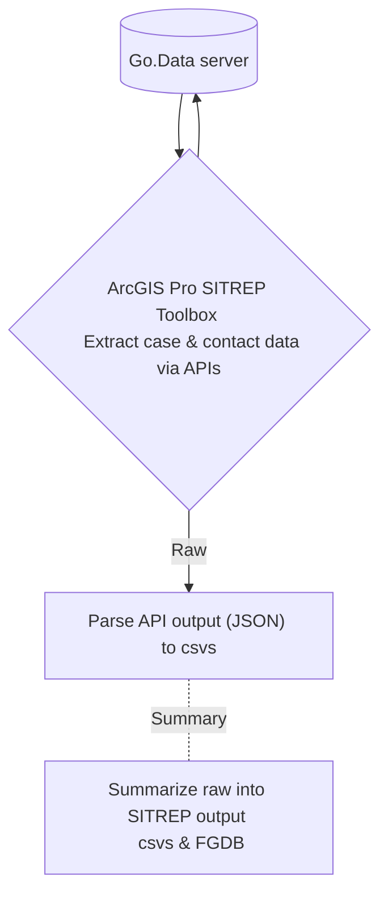

## Go.Data Flowchart

```mermaid
  graph TD
    A[(Go.Data server)]--> B{ArcGIS Pro SITREP Toolbox <br/> Extract case & contact data<br/>via APIs};
    B-->A
    B -->|Raw| C["Parse API output (JSON) to csvs"];
    C-.-|Summary| D[Summarize raw into SITREP output <br/> csvs & FGDB]; 
```

