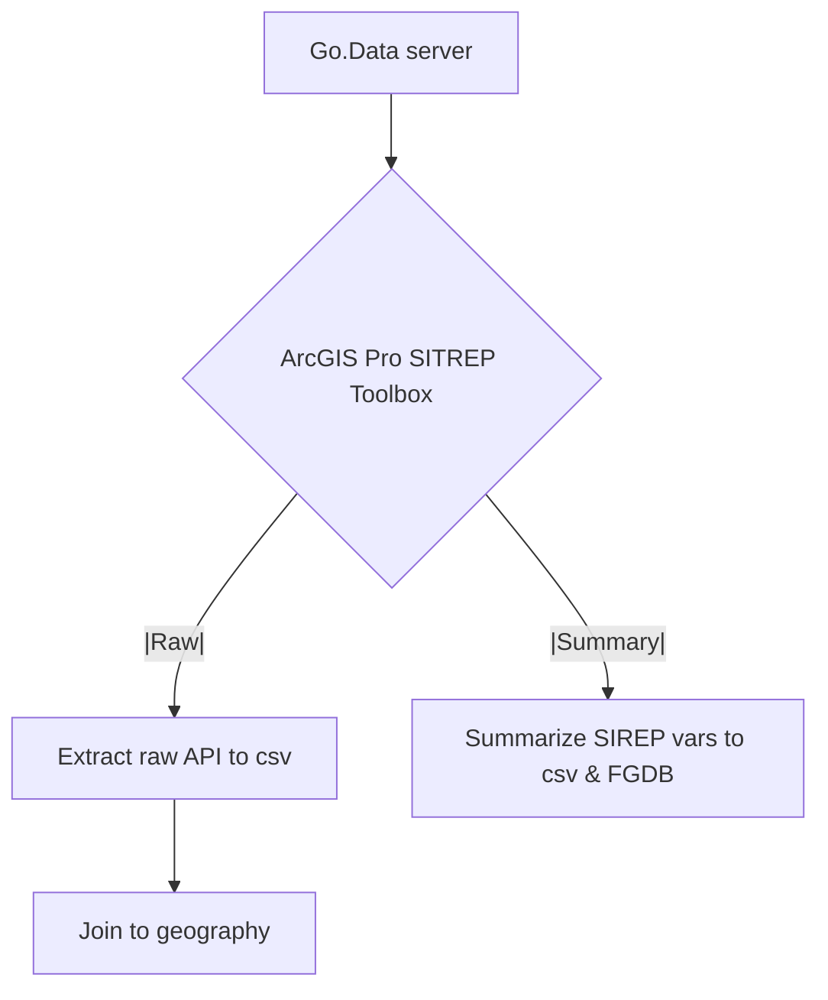

# hello-world
Testing out Github
Hoping I can finish this course this month!

## Diagram

```mermaid
  flowchart TD;
    A[Go.Data server]--> B{ArcGIS Pro SITREP Toolbox};
    B -- |Raw|-->C[Extract raw API to csv];
    B -- |Summary|--> D[Summarize SIREP vars to csv & FGDB];
    C --> E[Join to geography];
    
```

```mermaid
  graph TD;
      A-->B;
      A-->C;
      B-->D;
      C-->D;
```
